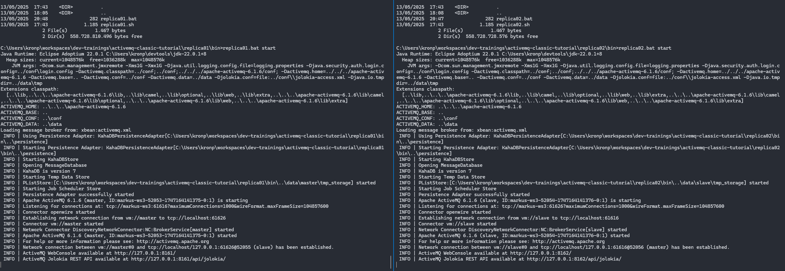

# ActiveMQ Classic Tutorial

This repository contains examples how to setup ActiveMQ Classic and how to send/receive messages using java. Please note, that code in this repo does not work with ActiveMQ Artemis. See [Artemis](https://github.com/starwit-trainings/apachemq-introduction) repo for according examples.

## Setup

### Prepare your computer
On your computer the following software needs to be installed:
* git ([Windows](https://git-scm.com/downloads) or [Winget](https://winget.run/pkg/Git/Git), Linux - use package manager)
* openJDK (aka Java Development Kit)
* [Maven](https://maven.apache.org/)
* an IDE to write code - [Visual Studio Code](https://code.visualstudio.com/) is recommended.

Optional
* Microsoft Terminal
* Docker
* [Java Mission Control](https://jdk.java.net/jmc/9/)
* [HawtIO](https://github.com/hawtio/hawtio/releases)

### Clone Code
Use git to download code from this repository to your computer. Open a command prompt/shell and use the following command to clone repository into current directory:
```bash
git clone https://github.com/starwit-trainings/activemq-classic-tutorial.git
```

### Setup ActiveMQ
You need to download and unzip ActiveMQ for your operating system. Find fitting package here: https://activemq.apache.org/components/classic/download/

All examples in this repo expect, that ActiveMQ is unzipped next to repo main repository. Resulting folder structure should look like so: 

```bash
.
..
activemq-classic-tutorial
apache-activemq-6.1.6
```

# Examples
In this section all examples in this repository are introduced. You can work with these examples in any order you like.

## Hello World
This first example will start a single ActiveMQ broker, connects a message receiver and a messager sender to it.

### Start Broker
The following commands will start a single broker instance. Open a shell (Windows: command prompt, Linux: e.g. Bash) in the base folder of this repository. Choose commands for your OS.
<table>
<tr>
<td> Windows </td> <td> Linux </td>
</tr>
<tr>
<td> 

```powershell
cd single\bin
single.bat start
```

</td>
<td>

```bash
cd single/bin
./single start
```

</td>
</tr>
</table>

Once broker is running message listener and producer can be connected.

### Start Message Listener/Producer
Use the following (Linux) commands to run listener and producer. Adapt if you use Windows.
```bash
cd clients/simple-listener
mvn clean package
java -jar target/simple-listener.jar
```

```bash
cd clients/simple-producer
mvn clean package
java -jar target/simple-producer.jar
```

If everything is started properly you should see an output like this:


## ActiveMQ Setups
This list of examples deal with running and configuring ActiveMQ broker.

### Simple Broker - Explore Admin Console

Start broker as desrcibed in example _Hello Word_. Once broker is started, adminstration console can be accessed via http://localhost:8161/ using admin/admin as credentials.

For an introduction to ActiveMQ console see [introduction](activemq-intro.md#admin-console).


### Replica Setup
In this example two broker instances will be started and configured as each other's replicas. 

Open two command prompts and start each instance like so:

```bash
cd replica01/bin
./replica01 start
```
If you started both instances, you should see log output like follows:


### Master/Slave setup

## Java Examples
A message broker is of little use, if no application is using it. 

### Using Jolokia API
ActiveMQ ships with a powerful API called Jolokia. With that API almost everything in a running broker instance can be manipulated. This example shows how to connect to this API and some usage examples.

Start [hello world](#hello-world) example omitting producer client. Then execute following commands:
```bash
cd clients/jolokia-client
mvn clean package
java -jar target/jolokia-client.jar
```

### Using HTTP as transport
This example shows you, how to send messages using HTTP(s) as transport protocol- __NOTE__: There are many _much better_ ways to achieve this. See sections [Jolokia API](#using-jolokia-api) or [Camel](#camel-examples) for better approaches.

Start [hello world](#hello-world) example omitting producer client. Then execute following commands:
```bash
cd clients/http-producer
mvn clean package
java -jar target/http-producer.jar
```

This example sends messages via a http tunnel. Next to the drawbacks of this protocol, note, that some pretty outdated libraries are necessary to run this example.

## Spring Boot Examples

### Rest Converter

### Scheduled Sender

## Camel Examples
Camel is a powerful framework to build message oriented applications. See repository TODO for an introduction and examples.