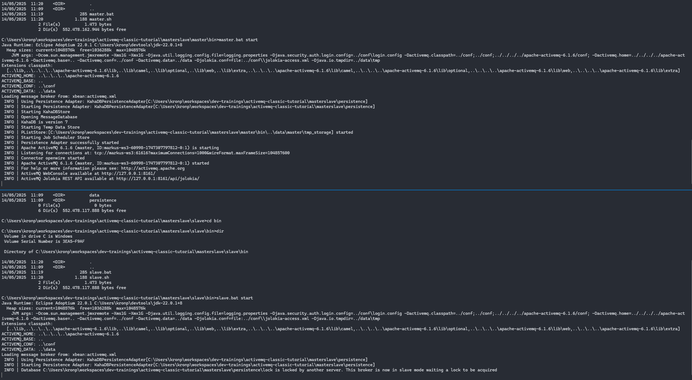

# ActiveMQ Setups
This list of examples deal with running and configuring ActiveMQ broker. For detailed configuration examples see section [replication](activemq-intro.md#replication).

## Simple Broker - Explore Admin Console

Start broker as desrcibed in example _Hello Word_. Once broker is started, adminstration console can be accessed via http://localhost:8161/ using admin/admin as credentials.

For an introduction to ActiveMQ console see [introduction](activemq-intro.md#admin-console).

## Replica Setup
In this example two broker instances will be started and configured as each other's replicas. Replica means, that two (or more) instances will share their state. That means if one goes down, the other can take over. Following image shows, how this works.


Note that it very much depends on the used communication protocol, if and how clients get notified about outage of a replica instance.

## Static configuration

Open two command prompts and start each instance like so:

```bash
cd broker-configs/replica/replica01/bin
./replica01.sh start
```
```bash
cd broker-configs/replica/replica02/bin
./replica02.sh start
```
If you started both instances, you should see log output like follows:


Run producer/listener from [hello world](hello-world.md#start-message-listenerproducer) example but change broker url to: _failover:(tcp://127.0.0.1:61616,tcp://127.0.0.1:61626)_


## Dynamic configuration

Open two command prompts and start each instance like so:
```bash
cd broker-configs/discovery/replica01/bin
./replica01.sh start
```
```bash
cd broker-configs/discovery/replica02/bin
./replica02.sh start
```
If your network connection supports multicast, instances will find each other.

### Tasks
* Start both instances
* Connect simple producer/listener
* Try to find out, which network ports are now open on your computer
* Shutdown one instance
* Restart instance & shutdown the other one
* add a third broker

## Master/Slave setup
ActiveMQ brokers can also run in a setup, where outage of one node is detected and a second broker is taking over. Example implemented here, is using shared storage and both broker instances run on the same machine. This way the second instance can take over all connections and clients can continue messaging with minimal outage. 

Next image shows how this example is implemented.


Start both instances with the following commands. Note you need to command prompts.
```bash
cd broker-configs/masterslave/master/bin
./master start
```

```bash
cd broker-configs/masterslave/slave/bin
./slave start
```
Once both instances are running, you should see the following log output.


Now you can access broker using [simple listener](clients/simple-listener/Readme.md) / [simple producer](clients/simple-producer/Readme.md). In order to test take over of second instance shutdown master (ctrl+c). In the following screenshot you'll see sample output.


### Tasks
* Start both instances
* Connect simple producer/listener
* Try to find out, which network ports are now open on your computer
* Shutdown one instance
* Restart instance & shutdown the other one