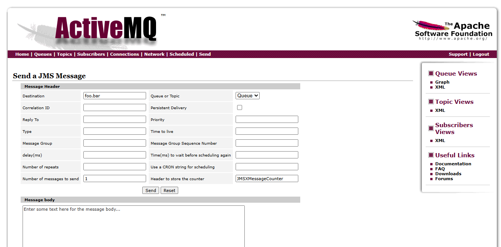

## Admin Console
ActiveMQ ships with an administration console that offers information and allows to send test messages. This section very quickly introduces most important parts. Compared to other message systems, ActiveMQ admin console offers only basic functions. This section will introduce most important dialogues.

Please note, that admin console is a Java webapplication that is hosted by the integrated Jetty app server. That means every broker can run its own console. See section [Config Files](#config-files-overview) for how to enable/disable admin console.

---

### List of Queues


---

### List of Topics


---

### Send Test Messages


---

### List connected clients


---

### Broker Protocols - which connections offers your instance


---

### Broker Network - all running & connected instances


---

### Tasks
* Create a queue _sample-queue_ and send a message
* Use simple-listener to receive message
* Create a topic _sample-topic_ and send a message
* Use simple-listener to receive message
* Connect simple listener/producer and observe results in Admin console
* Change admin password, [hint](#5-usersproperties)
* Disable admin console and restart instance 

---

## Config Files Overview
* Config files main mechanism to configure ActiveMQ
* Multiple files with multiple notations -> easy to confuse
* Broker setup vs authentication vs authorization vs persistence ... -> easy to confuse
* Embedded instances, Docker images

---

### 1. `activemq.xml`
- **Location**: `$ACTIVEMQ_HOME/conf/`
- **Purpose**: Primary broker configuration file.
- **Details**:
  - Defines broker instances, transport connectors (e.g., OpenWire, MQTT, AMQP), persistence, destinations (queues/topics), and plugins.
  - Customizable using Spring XML syntax.
  - Example: Add SSL connectors, configure persistence adapters, or define virtual destinations.

---

### 2. `jetty.xml`
- **Location**: `$ACTIVEMQ_HOME/conf/`
- **Purpose**: Configures the embedded Jetty web server.
- **Details**:
  - Manages HTTP endpoints, including the web console and REST interfaces.
  - Can be used to secure the web interface with SSL or basic authentication.

---

### 3. `jetty-realm.properties`
- **Location**: `$ACTIVEMQ_HOME/conf/`
- **Purpose**: Defines web console user credentials.
- **Details**:
  - Used in conjunction with `jetty.xml` for basic authentication.
  - Format: `username: password, role`

---

### 4. `login.config`
- **Location**: `$ACTIVEMQ_HOME/conf/`
- **Purpose**: JAAS (Java Authentication and Authorization Service) login module configuration.
- **Details**:
  - Specifies authentication mechanisms (e.g., property files, LDAP).
  - Used when `jaasAuthenticationPlugin` is enabled in `activemq.xml`.

---

### 5. `users.properties`
- **Location**: `$ACTIVEMQ_HOME/conf/`
- **Purpose**: Defines user credentials for JAAS authentication.
- **Details**:
  - Format: `username=password`
  - Used when JAAS is configured with `PropertiesLoginModule`.

---

### 6. `groups.properties`
- **Location**: `$ACTIVEMQ_HOME/conf/`
- **Purpose**: Maps users to groups for authorization.
- **Details**:
  - Format: `group=user1,user2,...`
  - Required when using group-based access control.

---

### 7. `log4j.properties`
- **Location**: `$ACTIVEMQ_HOME/conf/`
- **Purpose**: Controls logging behavior.
- **Details**:
  - Defines log levels, appenders, and logging formats.
  - Helps with troubleshooting broker and client behavior.

---

### 8. `activemq.policy` (optional)
- **Location**: `$ACTIVEMQ_HOME/conf/`
- **Purpose**: Java security policy file (if security manager is used).
- **Details**:
  - Defines permissions for classes and code sources.
  - Used when running ActiveMQ with a security manager.


---

## Jolokia API
Jolokia is a management API, with which all configuration and functions of ActiveMQ can be observed and manipulated. In fact admin console is build using this API.

In order to run the following examples, a running broker instance is necessary. See [Hello world example](Readme.md#hello-world) how to run an instance. If you use another instance responses may vary.

First example returns a list of everything, that is accessible via Jolokia.
```bash
curl -XGET -u admin:admin -H "Origin:http://localhost"  http://localhost:8161/api/jolokia/list
```
Note that it is necessary to set origin header. Without it ActiveMQ will refuse to answer - see section [security](#security).

---
Next example lists all available destinations. Note that broker name needs to be set according to your instance.
```bash
curl -XGET -u admin:admin -H "Origin:http://localhost" "http://localhost:8161/api/jolokia/search/org.apache.activemq:type=Broker,brokerName=single,destinationType=Queue,destinationName=*"
```
Response will look like this. Note, if no queue exists yet, response will be empty.
```JSON
{
  "request": {
    "mbean": "org.apache.activemq:brokerName=single,destinationName=*,destinationType=Queue,type=Broker",
    "type": "search"
  },
  "value": [
    "org.apache.activemq:brokerName=single,destinationName=test01,destinationType=Queue,type=Broker",
    "org.apache.activemq:brokerName=single,destinationName=test,destinationType=Queue,type=Broker"
  ],
  "status": 200
}
```
---
The following two example query an MBean. The first one collects all attributes if broker object.

```bash
curl -XGET -u admin:admin -H "Origin:http://localhost" "http://localhost:8161/api/jolokia/read/org.apache.activemq:type=Broker,brokerName=single/*"
```

This request will result in a response like this.
```JSON
{
  "request": {
    "mbean": "org.apache.activemq:brokerName=single,type=Broker",
    "type": "read"
  },
  "value": {
    "StatisticsEnabled": true,
    "TemporaryQueueSubscribers": [],
    "TotalConnectionsCount": 1,
    "TotalMessageCount": 1,
    "TempPercentUsage": 0,
    "MemoryPercentUsage": 0,
    "TransportConnectors": {
      "openwire": "tcp://markus-workstation-starwit:61616?maximumConnections=1000&wireFormat.maxFrameSize=104857600",
      "http": "http://markus-workstation-starwit:8080?transport.maximumConnections=1000&transport.wireFormat.maxFrameSize=104857600&transport.keepAlive=true&transport.trace=true&transport.useKeepAlive=true&transport.connectionTimeout=30000",
      "ws": "ws://markus-workstation-starwit:61614?maximumConnections=1000&wireFormat.maxFrameSize=104857600"
    },
....
```
---
If you want to query a single field - very handy to build a simple monitoring script - the following example gets a single field.
```bash
curl -XGET -u admin:admin -H "Origin:http://localhost" "http://localhost:8161/api/jolokia/read/org.apache.activemq:type=Broker,brokerName=single/TotalMessageCount"
```

There is a lot more this API can be used for. For an overview of all Mbeans see documention here:
https://activemq.apache.org/components/classic/documentation/jmx
An other way to get a full list can be found in section [Java Mission Control](#java-mission-control).

### Tasks
* Add a queue on admin console and observe output of queue listing.
* Modify destination request to topics. Add topics on admin console and observe output.
* Add an additional protocol to single instance (see next section), restart broker and query broker object.

---
## Protocols

ActiveMQ offers a number of communication protocols. For each protocol a connector needs to be configured. Following configuration extract is from _activemq.xml_. It shows connectors for the [single](activemq-examples.md#simple-broker---explore-admin-console) instance.

```xml
        <transportConnectors>
            <!-- DOS protection, limit concurrent connections to 1000 and frame size to 100MB -->
            <transportConnector name="openwire" uri="tcp://0.0.0.0:61616?maximumConnections=1000&amp;wireFormat.maxFrameSize=104857600"/>
            <transportConnector name="ws" uri="ws://0.0.0.0:61614?maximumConnections=1000&amp;wireFormat.maxFrameSize=104857600"/>
            <transportConnector name="http" uri="http://0.0.0.0:8080?transport.maximumConnections=1000&amp;transport.wireFormat.maxFrameSize=104857600&amp;transport.keepAlive=true&amp;transport.trace=true&amp;transport.useKeepAlive=true&amp;transport.connectionTimeout=30000" />            
        </transportConnectors>
```

For obvious reasons your instances should only offer protocols, that your clients need. So the example shows only a subset of the supported protocols. A complete list can be found here: https://activemq.apache.org/components/classic/documentation/protocols

---

### Tasks
* Select a protocol and add a connector to single instance. Start broker and check via admin console, that new connector is available.
* __Bonus challenge:__ Enable MQTT and send/receive messages using a MQTT messaging tool

---
## Client connection options
https://activemq.apache.org/components/classic/documentation/uri-protocols

---
## Replication
One of the core features of message brokers, is the possibility to run multiple instances. This way setups that are able to deal with with high loads become possible as well as minimizing outages via replication. This section is a (brief) introduction into this topic. 

__Please note__ that high-availability is very hard to achieve, as many, many more aspects than message broker config needs to be configured and set up properly. So if you aim at HA start by familiarizing yourself with the general concept. A good starting point is [Wikipedia](https://en.wikipedia.org/wiki/High_availability).

### Static

```xml
    <networkConnectors>
        <networkConnector uri="static:(tcp://localhost:61616)" />
    </networkConnectors>  
```
---
### Discovery/Multicast
```xml
    <networkConnectors>
      <networkConnector uri="multicast://default"/>
    </networkConnectors>

    <transportConnectors>
      <transportConnector uri="tcp://localhost:0" discoveryUri="multicast://default"/>
    </transportConnectors>
```

Reference: https://activemq.apache.org/components/classic/documentation/networks-of-brokers

### Tasks
* 

---
## Security

* Broker instances so far not secured - don't use them in production
* Brief intro into security configuration
* Full documentation https://activemq.apache.org/components/classic/documentation/security
* Topics
  * Authentication & Roles - Change passwords, add users
  * Authorization & auto creation of destinations
  * Disable Admin Console!
  * Notes on CORS
  * Static destination creation

---

### Authentication & Roles

Clients should never use admin privilege to send/receive messages

Add non-privileged group in _groups.properties_
```properties
admins=admin
clients=client1,client2
```

Add credentials for non-privileged users in _users.properties_
```properties
admin=admin
client1=client1
client2=client2
```

---

### Authorization / Disable auto creation of destinations
Following extract from [activemq.xml](#1-activemqxml) shows how to allow destination creation role based.
```xml
<plugins>
    <jaasAuthenticationPlugin configuration="activemq" />
    <authorizationPlugin>
        <map>
            <authorizationMap>
                <authorizationEntries>
                    <authorizationEntry topic="ActiveMQ.Advisory.>" 
                                        read="admins,clients" 
                                        write="admins,clients" 
                                        admin="admins,clients"/>
                    <authorizationEntry queue=">" read="admins,clients" 
                                                  write="admins,clients" 
                                                  admin="admins" />
                    <authorizationEntry topic=">" read="admins,clients" 
                                                  write="admins,clients" 
                                                  admin="admins" />
                </authorizationEntries>
            </authorizationMap>
        </map>
    </authorizationPlugin>
</plugins>
```

---
### Static destination creation

In some scenarios dynamic creation of destination may be undesireable. Following snippet from [activemq.xml](#1-activemqxml) shows, how to statically create queues/topics.

```xml
  <destinations>
      <queue physicalName="prefonfigured.queue" />
      <topic physicalName="prefonfigured.topic" />
  </destinations>
```

---

### Disable Admin Console
* Admin console is very powerful - very dangerous!
* Should be disabled in production
* If not disabled , unreachable from outside networs
* Disable by commenting out this section in [__activemq.xml__](#1-activemqxml):
```xml
    <!--
        Enable web consoles, REST and Ajax APIs and demos
        The web consoles requires by default login, you can disable this in the jetty.xml file

        Take a look at ${ACTIVEMQ_HOME}/conf/jetty.xml for more details
    -->
    <import resource="jetty.xml"/>

</beans>
```

---
## Persistence

---
## Instrument & Monitor ActiveMQ

As a Java application ActiveMQ can be instrumented and monitored using many standard tools. In this section, we will look into some of them. If you are interested in more sophisticated monitoring solutions, have a look into [Open Telemetry example](https://github.com/starwit-trainings/otel-demo).

---

### Java Mission Control
ActiveMQ makes use of Java's JMX interface and thus any JMX tool can be used, to observe a running broker. One of those tools is Java Mission Control. If you run in on the same machine as your broker instance, you can connect it right away. 

Once connected, you can browse all available MBeans (JMX' way to expose data and functions). See the following picture for an example:


---
#### Tasks
* Start a broker instance
* Run JMC and connect to instance
* Choose on Mbean and extract value, trigger a method

---
### HawtIO
TODO

---
### ActiveMQ, Prometheus, Grafana
Another way to get insights of a running ActiveMQ instance is by extracting data via a Java agent. A pre-configured instance in folder single-jmx is provided, that exposes metrics on port 7878. In this example these metrics are collected by Prometheus and visualized with Grafana. Setup shall provide a development environment, to explore metrics and visualizations. It is not intended to be used in a productive environment.

Start instance _single-jmx_ like so:
<table>
<tr>
<td> Windows </td> <td> Linux </td>
</tr>
<tr>
<td> 

```powershell
cd single-jmx\bin
single.bat start
```

</td>
<td>

```bash
cd single-jmx/bin
./single start
```

</td>
</tr>
</table>

Metrics should now be available under http://localhost:7878/metrics

#### Start Prometheus & Grafana
Prometheus is a metric collector and is used in many monitoring setups. Grafana is a visualization tool, that can be used to create dashboards displaying metric data. In order run and configure both tools, we can either use Docker compose or manual setup.

---

__Docker Compose__

Docker is necessary to run compose scripts. Install for your [Linux](https://docs.docker.com/engine/install/) distribution or [Docker Desktop](https://docs.docker.com/desktop/setup/install/windows-install/) for Windows.

Now run Docker compose file like so:
```bash
cd docker-compose
docker compose -f compose-monitoring.yaml up
```
This is going to run Prometheus (http://localhost:9090/) and Grafana (http://localhost:3000/). Both are pre-configured such that:
* Prometheus collects metrics from ActiveMQ
* Grafana uses Prometheus as data source
* An ActiveMQ dashboard displaying metrics

---
__Manual Setup__

Download Prometheus here: https://prometheus.io/download/ In folder [prometheus](docker-compose/prometheus/) you find a config file, that can be used to run Prometheus. Check that metrics are collected.

To setup Grafana manually:
* download and install Grafana: https://grafana.com/grafana/download
* configure Prometheus data source
* import [Dashboard](docker-compose/grafana/provisioning/dashboards/activemq/activemq.json)


#### Tasks
* Run setup
* Connect producer/listener and observe output


<style>
header {
  text-align: right;
  font-size: 0.7rem;
  color: #bbb;
  margin: 20px;
  left: 0px;
  right: 0px;
  padding-top: 5px;
}
footer {
  font-size: 0.7rem;
  color: #bbb;
}
section.lead {
  text-align: center;
  margin-bottom: 40px;
}
section {
  font-size: 1.2rem;
}
section.lead h1 {
  font-size: 2.5rem;
  font-weight: 600;
}
section.linked footer {
  display: none;
}
section.linked header {
  display: none;
}
section.quote {
  font-size: 1.0rem;
  text-align: center;
  font-style: italic;
  color: #555;
}

h1 {
  font-size: 2.5rem;
  font-weight: 500;
  color: #2B5A6A;
}
h2 {
  font-size: 1.8rem;
  font-weight: 400;
  color: #333;
  margin-top: 30px;
  margin-bottom: 15px;
  text-transform: uppercase;
}
a {
  color: #3A9FC1;
}
a:hover {
  color: #1E708B; 
  text-decoration: underline; 
}
ul {
  text-align: left
}
</style>