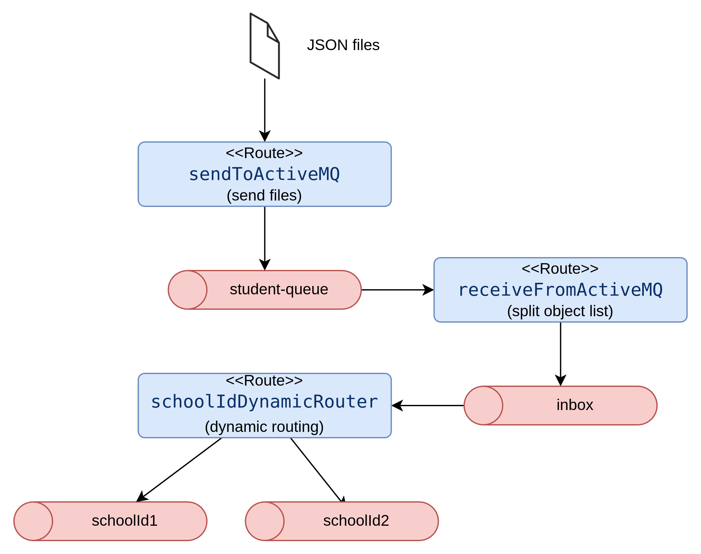

# Camel Dynamic Routing
Camel framework has connectors for a huge number of messaging systems. In this example a list of student results objects is send to a queue, a receiver splits these lists in individual objects and forwards it to a second queue. From those messages are read by a third route and depending on value of field _schoolId_ message is forwarded to a queue with the same name.



```bash
cd camel/camel-dynamic-route
mvn clean package
java -jar target/camel-dynamic-route.jar
```