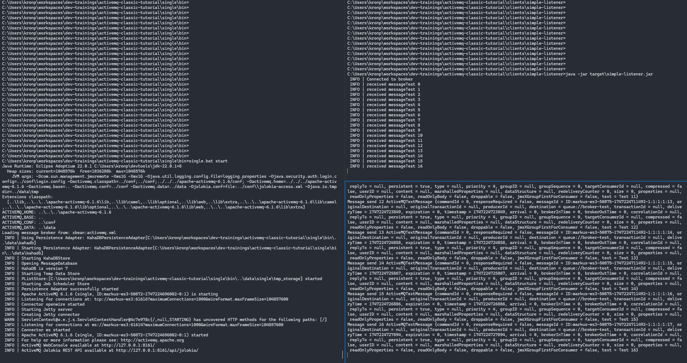

## Hello World
This first example will start a single ActiveMQ broker, connects a message receiver and a messager sender to it.

### Start Broker
The following commands will start a single broker instance. Open a shell (Windows: command prompt, Linux: e.g. Bash) in the base folder of this repository. Choose commands for your OS.
<table>
<tr>
<td> Windows </td> <td> Linux </td>
</tr>
<tr>
<td> 

```powershell
cd single\bin
single.bat start
```

</td>
<td>

```bash
cd single/bin
./single start
```

</td>
</tr>
</table>

Once broker is running message listener and producer can be connected.

### Start Message Listener/Producer
Use the following (Linux) commands to run listener and producer. Adapt if you use Windows.
```bash
cd clients/simple-listener
mvn clean package
java -jar target/simple-listener.jar
```

```bash
cd clients/simple-producer
mvn clean package
java -jar target/simple-producer.jar
```

If everything is started properly you should see an output like this:

