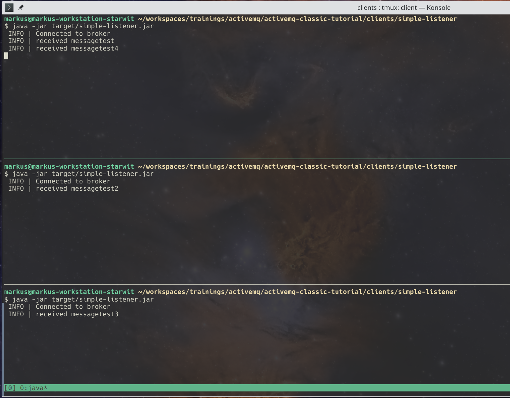
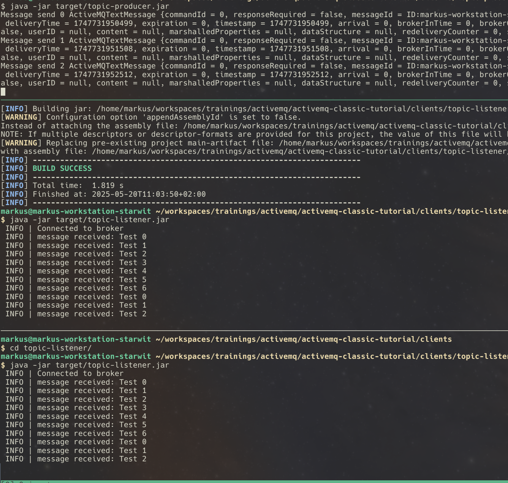

# Java Examples
This section covers how to connect to ActiveMQ using the Java programming language.

## Simple Listener/Producer
This example runs a producer, that sends a fixed number of messages to a queue. Second component is a listener, that receives messages and output received messages

Use the following (Linux) commands to run listener and producer. Adapt if you use Windows.
```bash
cd clients/simple-listener
mvn clean package
java -jar target/simple-listener.jar
```

```bash
cd clients/simple-producer
mvn clean package
java -jar target/simple-producer.jar
```

### Tasks
* Run both apps
* Change send message
* Make number of messages/queue name configurable via app properties

## Queue Example
This example will show you, how a multitude of consumers can connect to a queue. Every message is delivered to exactly one consumer. So start [single](activemq-examples.md#simple-broker---explore-admin-console) instance and compile simple listener like so:

```bash
cd clients/simple-listener
mvn clean package
```

Now open three command prompts and run in each:
```bash
java -jar target/simple-listener.jar
```

Your setup has now a broker with three connected clients. You can either use [admin console](activemq-intro.md#admin-console) or [simple producer](#simple-listenerproducer) to create messages.

Once you send messages, you should see an output like this:


### Tasks
* Run setup
* Run simple producer and observe output
* Shutdown all listeners and let producer send more messages. Restart a listener.
* Reduce wait time in producer loop and observe how fast your setup can deliver messages
* __Bonus Challenge:__ Run replica setup and connect three listeners. Run producer and shutdown one instance.

## Topic Example
In some scenarios message shall be received by every subscribed client. This communication model can be achieved by using topics. As always you need a running broker, so start [single](activemq-examples.md#simple-broker---explore-admin-console) instance.

```bash
cd clients/topic-listener
mvn clean package
```

Now open multiple command prompts and run in each:
```bash
java -jar target/topic-listener.jar
```
Once you send messages, you should see an output like this:


### Tasks
* Run setup and observe output
* Shutdown all listeners and let producer send more messages. Restart a listener.
* __Bonus Challenge:__ Run replica setup and connect three listeners. Run producer and shutdown one instance.

## Using Jolokia API
ActiveMQ ships with a powerful API called Jolokia. With that API almost everything in a running broker instance can be manipulated. This example shows how to connect to this API and some usage examples.

Start [hello world](#hello-world) example omitting producer client. Then execute following commands:
```bash
cd clients/jolokia-client
mvn clean package
java -jar target/jolokia-client.jar
```

### Tasks
* Run example
* Add a method to list all topics
* Add a method, that gets total message count, see [here](activemq-intro.md#jolokia-api) for help
* __Bonus challenge:__ Parse Jolokia output into Java objects

## Using HTTP as transport
This example shows you, how to send messages using HTTP(s) as transport protocol- __NOTE__: There are many _much better_ ways to achieve this. See sections [Jolokia API](#using-jolokia-api) or [Camel](#camel-examples) for better approaches.

Start [hello world](#hello-world) example omitting producer client. Then execute following commands:
```bash
cd clients/http-producer
mvn clean package
java -jar target/http-producer.jar
```

This example sends messages via a http tunnel. Next to the drawbacks of this protocol, note, that some pretty outdated libraries are necessary to run this example.

### Tasks
* Run example
* Run example using either [replica](activemq-examples.md#replica-setup) or [master/slave](activemq-examples.md#masterslave-setup) setup. Shutdown one of the instances and observe output.