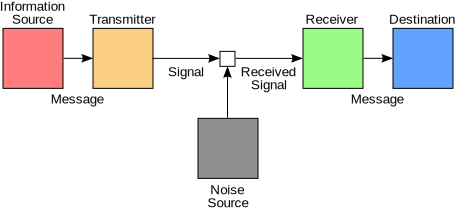
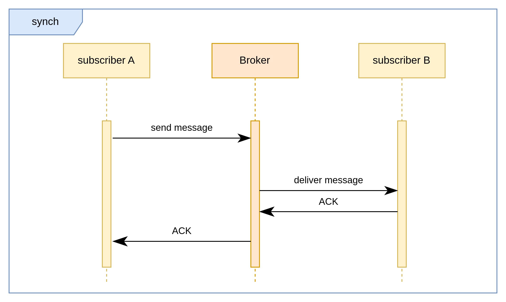
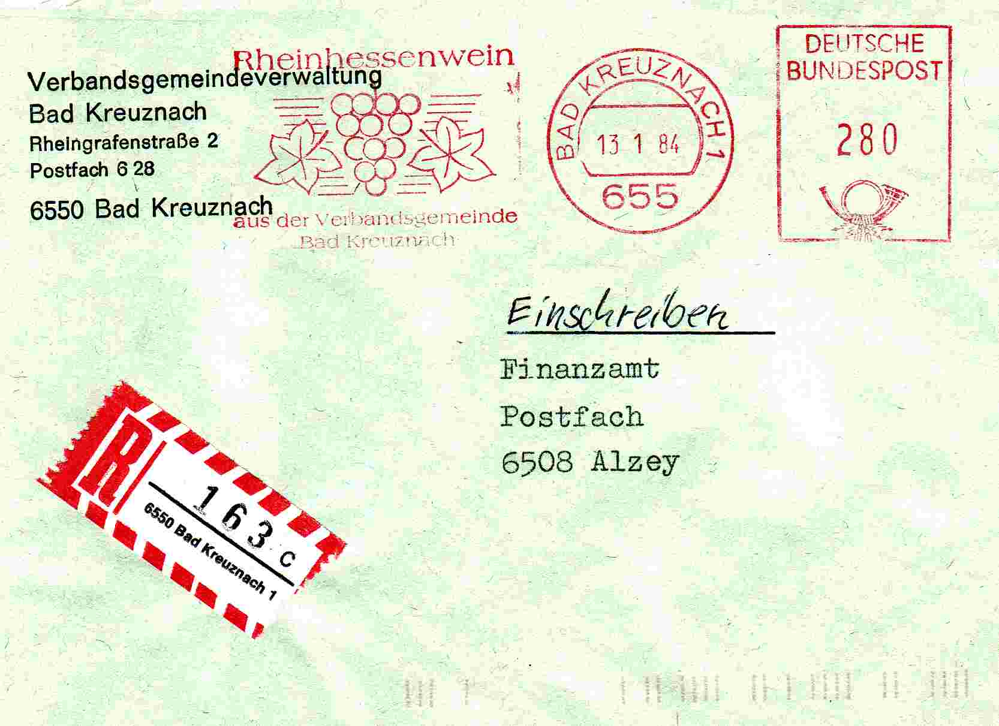
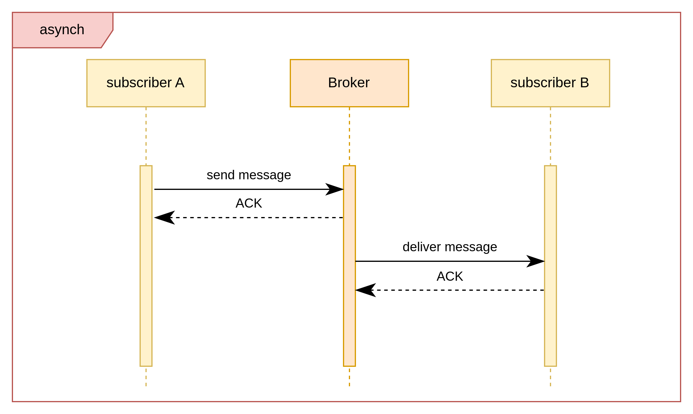
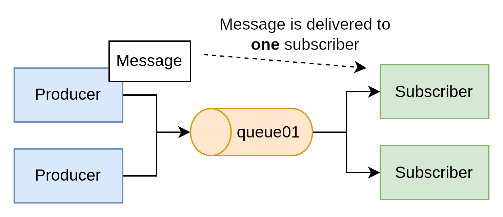
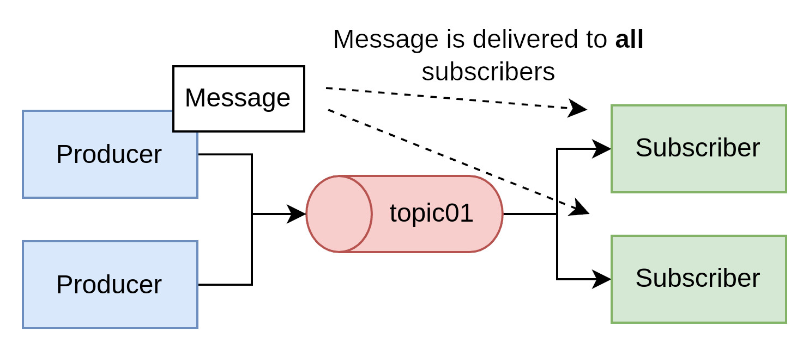

## Communication Patterns

 

Source: https://commons.wikimedia.org/wiki/File:Shannon-Weaver_model_of_communication.svg  

---

### Synchronous

---

How to implement with pen & paper:
 
Source: https://commons.wikimedia.org/wiki/File:Einschreiben-VG.jpg

---
Sample Protocols
* HTTP
* gRPC
* SIP

__Do you know other protocols?__

---
### Asynchronous

---

An analogy: message without an answer...

Source: https://commons.wikimedia.org/wiki/File:Aircraft_Combat_Archer_(2565196807).jpg 

---

Sample Protocols
* JMS
* AMQP
* SMS

__Do you know other protocols?__

---

## Java Messaging System

The **Java Messaging System (JMS)** is a Java API that allows applications to create, send, receive, and read messages. It provides a reliable, asynchronous communication mechanism between distributed components in a loosely coupled architecture.

---
### Key Features

- **Asynchronous communication**: Enables systems to continue processing without waiting for a response.
- **Loose coupling**: Allows components to interact without being directly connected.
- **Reliable message delivery**: Ensures messages are not lost, even if a component is temporarily unavailable.

---
## Messaging Models

JMS supports two primary messaging models, each suited to different communication needs: Queues & Topics

Both models are valuable and can be used together in enterprise messaging systems depending on the application's needs.

---
### 1. Point-to-Point (Queue-based)

In the **point-to-point** model, messages are sent to a specific **queue**, and **each message is consumed by exactly one receiver**.

- **Use Case**: Task distribution, load balancing, work queues.
- **Message Flow**:
  - A producer sends a message to a queue.
  - A consumer receives and processes the message.
  - Once delivered, the message is removed from the queue.
- **Delivery**:
  - Only one consumer receives each message.
  - Consumers can compete for messages in the queue (competing consumers pattern).
- **Durability**:
  - Messages are stored in the queue until a consumer retrieves them or they expire.
- **Decoupling**:
  - Producer and consumer do not need to run at the same time.
---

---

### 2. Publish/Subscribe (Topic-based)

In the **publish/subscribe** model, messages are sent to a **topic**, and **all active subscribers receive a copy** of each message.

- **Use Case**: Event broadcasting, real-time updates, data distribution.
- **Message Flow**:
  - A producer publishes a message to a topic.
  - All currently subscribed consumers receive the message.
- **Delivery**:
  - Multiple consumers receive the same message.
  - Subscribers must be active at the time the message is published (unless they are durable subscribers).
- **Durability**:
  - **Non-durable**: Subscribers only receive messages while actively connected.
  - **Durable**: Subscribers can receive missed messages sent while they were offline (if configured as durable).
- **Decoupling**:
  - Supports one-to-many communication patterns; producers remain unaware of how many consumers exist.
---

---

### Summary Table

| Feature              | Queue (Point-to-Point)       | Topic (Publish/Subscribe)     |
|----------------------|------------------------------|-------------------------------|
| Communication Style  | One-to-one                   | One-to-many                   |
| Message Receiver     | Single consumer              | All active subscribers        |
| Use Cases            | Task queues, job processing  | Notifications, live feeds     |
| Message Retention    | Until consumed or expired    | Only while subscriber is active (unless durable) |
| Subscriber Awareness | No                          | Subscribers must be registered |
| Durability Option    | Yes                          | Yes (with durable subscribers) |

---
### Basic Components

- **Producer**: Sends messages to a destination (queue or topic).
- **Consumer**: Receives messages from a destination.
- **Destination**: Either a queue or a topic.
- **Message**: The data object transmitted between producer and consumer.
- **JMS Provider**: The messaging system implementation (e.g., ActiveMQ, RabbitMQ with JMS support).

---

### Version History

- **JMS 1.0 (1999)**: Introduced as part of Java EE, establishing the basic messaging API.
- **JMS 1.1 (2002)**: Unified queue and topic APIs, simplifying development.
- **JMS 2.0 (2013)**: Added simplified API, annotations, and delivery delay options; part of Java EE 7.
- **JMS 2.0.1 / Jakarta Messaging 2.0.1 (2019)**: Transitioned to Jakarta EE; minor updates and namespace change.
- **Jakarta Messaging 3.0 (2020)**: Aligned with Jakarta EE 9; introduced Jakarta namespace changes (e.g., `javax.jms` to `jakarta.jms`).

---

### Example Use Cases

- Order processing systems
- Notification services
- Logging and monitoring pipelines

JMS is widely used in enterprise applications where decoupled, reliable communication is essential. It's part of the **Jakarta EE (formerly Java EE)** platform but can also be used in standalone Java applications.

---

## Protocols
* Protocol overview

---

## Load Balancing & High Availability

__Please note__ that high-availability is very hard to achieve, as many, many more aspects than message broker config needs to be configured and set up properly. So if you aim at HA start by familiarizing yourself with the general concept. A good starting point is [Wikipedia](https://en.wikipedia.org/wiki/High_availability).

* Intro to HA
* Failover
* Zero-downtime
* Load Balancing != HA
* Redundancy != HA

---

* And Kubernetes?

